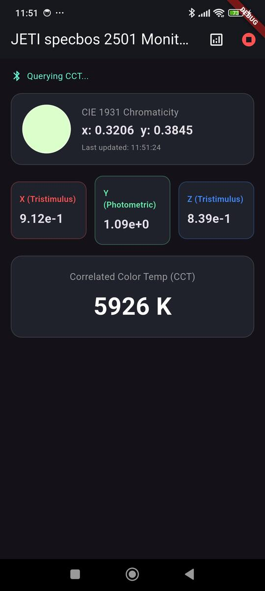
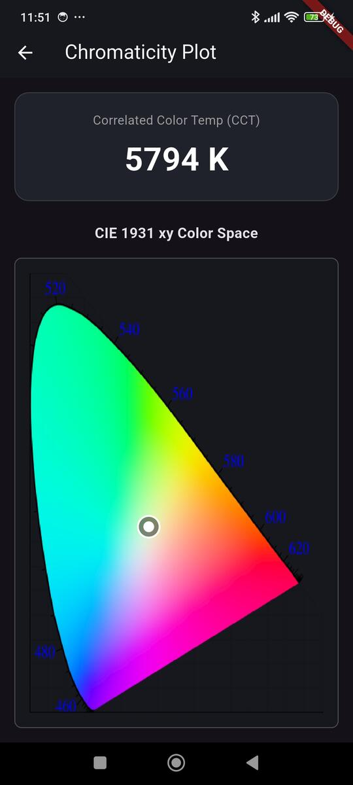

# JETI specbos 2501 Flutter Monitor

A Flutter application designed to interface wirelessly with the **JETI specbos 2501 spectroradiometer**. This application leverages Bluetooth Classic (RFCOMM/SPP) to execute SCPI firmware commands, enabling real-time extraction of photometric and colorimetric data directly to an Android device.

## Screenshots
 

## Features

* **Wireless Device Control:** Connects to the specbos 2501 via Bluetooth Classic SPP using the `flutter_classic_bluetooth` package, bypassing USB power constraints.
* **Real-Time Telemetry:** Continuous asynchronous polling loop executing dark and light measurement scans (`*MEAS:DARK`, `*MEAS:LIGHT`).
* **Colorimetry & Photometry:** Extracts and visualizes CIE 1931 xy chromaticity coordinates, Photometric values (Luminance/Illuminance), Correlated Color Temperature (CCT), and calculated Tristimulus (X, Y, Z) data.
* **Flicker Detection:** On-demand flicker frequency measurement (`*MEAS:FLIC`) integrated with a UI toggle to prevent blocking the high-speed colorimetry polling loop.
* **Data Recording & Export:** Toggleable data logging that buffers timestamps, colorimetry, photometry, and flicker data, exporting it to the device storage as a formatted JSON file using the native file picker.
* **Diffuser Auto-Calibration:** Automatically configures the spectroradiometer to apply the correct calibration profile (`*PARA:CALIBN 0`) when a diffuser attachment is detected for Lux measurements.
* **CIE 1931 Visualization:** Features a dynamic chromaticity plot utilizing a Flutter `CustomPainter` to map real-time (x, y) coordinates onto the standard CIE 1931 color space diagram.
* **Reactive Architecture:** Built on `flutter_bloc` utilizing a Cubit state machine to separate the serial byte-parsing logic and asynchronous SCPI handshakes from the UI presentation layer.

## Hardware Requirements
* **Android Device:** Must support Bluetooth Classic and grant `BLUETOOTH_CONNECT` and `BLUETOOTH_SCAN` permissions.
* **[JETI specbos 25x1](https://www.jeti.com/products/spectroradiometer/spectroradiometer-jeti-specbos-2501):** The instrument must have its internal Bluetooth module enabled.
    * *Note: If Bluetooth is disabled, connect via USB and send `*CONF:BTEN 1` followed by `*PARA:SAVE` using a terminal emulator prior to using this app.*

## Project Structure
```
lib/
├── main.dart                 # Application entry point and theme configuration
├── dashboard_screen.dart     # Primary telemetry view (XYZ, CCT, Flicker, state indicators)
├── chromaticity_screen.dart  # Custom CIE 1931 graphing canvas
└── jeti_cubit.dart           # SPP stream parsing, state management, and SCPI command loop
```

## Architecture Notes
### SCPI Command Polling
The application interfaces with the specbos firmware by streaming standard SCPI strings terminated with a Carriage Return (`\r`). The JetiCubit maintains an asynchronous loop that waits for explicit firmware acknowledgments. To maximize the refresh rate, the parsing logic filters out standard strings and specifically targets the ASCII `BELL` (`07 hex`) control character emitted by the device to determine exact measurement completion times, rather than relying on arbitrary delays.

### State Management
The UI strictly reflects the `JetiState` yielded by the `JetiCubit`. This ensures that UI thread blocking does not occur during intensive serial byte decoding or while the device's mechanical shutter is operating. Corrupted packets over the RFCOMM stream are handled gracefully by defaulting to the previous valid measurement state.

## Setup & Installation
1. **Clone the repository:**
```bash
git clone https://github.com/IoT-gamer/flutter_jeti_specbos_2501_app.git
cd flutter_jeti_specbos_2501_app
```
2. **Install dependencies:**
```bash
flutter pub get
```
3. **Android Permissions:** Ensure location services are enabled on the physical Android device, as modern Android versions require this to discover Bluetooth Classic hardware.
4. **Run the application:**
```bash
flutter run
```
## License
This project is licensed under the MIT License - see the [LICENSE](LICENSE) file for details.

## Acknowledgements & References
* [Operating Instructions - Firmware](https://www.jeti.com/downloads/send/5-manuals/11-operating-instructions-firmware)
* [CIE 1931 color space chromaticity diagram](https://commons.wikimedia.org/wiki/File:CIE1931xy_blank.svg)
    * `assets/cie_1931_cropped.png` was derived from this source